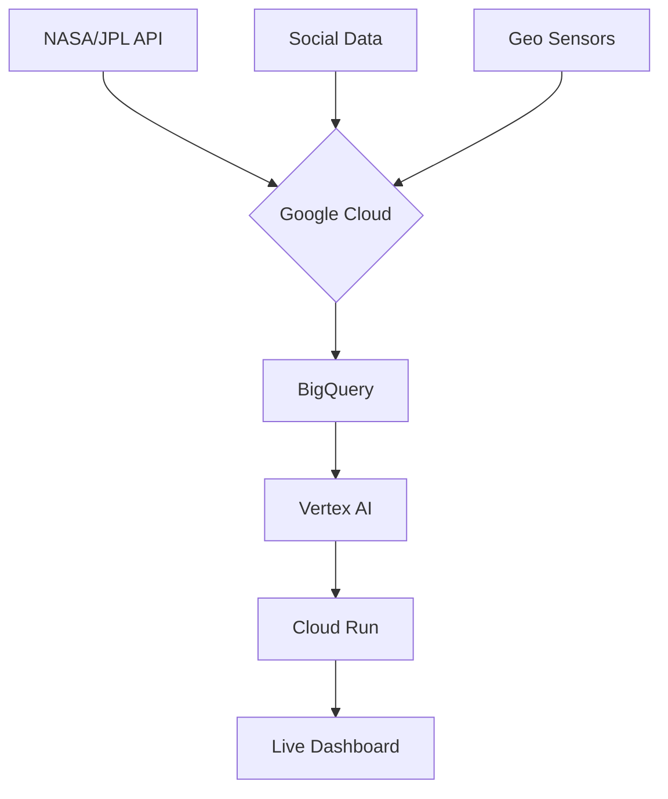

# 🏗️ Google Cloud Architecture

## System Design

```mermaid
graph TB
    A[NASA/JPL API] --> D{Google Cloud}
    B[Social Data] --> D
    C[Geo Sensors] --> D
    D --> E[BigQuery]
    E --> F[Vertex AI]
    F --> G[Cloud Run]
    G --> H[Live Dashboard]
```
