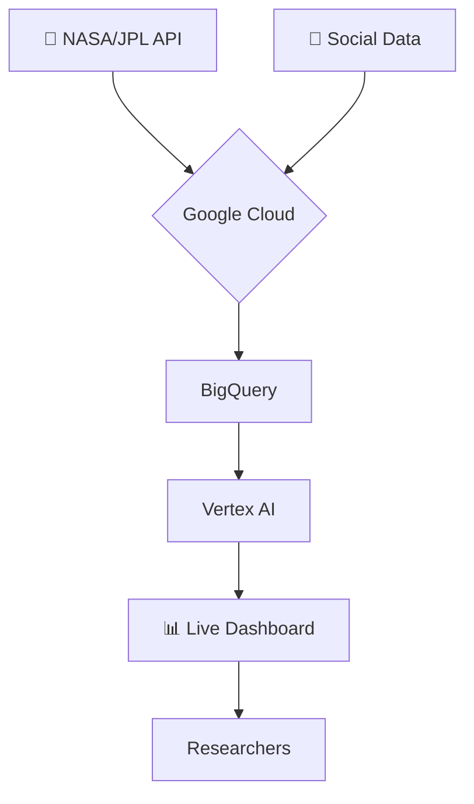

# 🌌 TRINITY FRAMEWORK

**Where Big Data Meets The Great Work**  
*Real-time consciousness-astronomy correlation engine*

## 🚀 Mission
Track 31/ATLAS comet while correlating with global consciousness patterns using Google Cloud AI.

## 📁 Project Structure 

```markdown
```

trinity-framework/
├── trinity_engine.py     # Core correlation engine
├── ARCHITECTURE.md       # System architecture diagram
├── requirements.txt      # Python dependencies
├── .gitignore           # Python ignore rules
├── LICENSE              # MIT License
└── README.md            # This file

```

## 🔧 Quick Start
```bash
git clone https://github.com/YOUR-USERNAME/trinity-framework
cd trinity-framework
python trinity_engine.py
```

🏗️ Architecture



📞 Contact

Ready for Google Cloud deployment. Let's build the future.

---

"We don't just observe the cosmos. We correlate with it."

```
graph TD
    A[🔭 NASA/JPL API] --> C{Google Cloud}
    B[🧠 Social Data] --> C
    C --> D[BigQuery]
    D --> E[Vertex AI]
    E --> F[📊 Live Dashboard]
    F --> G[Researchers]
